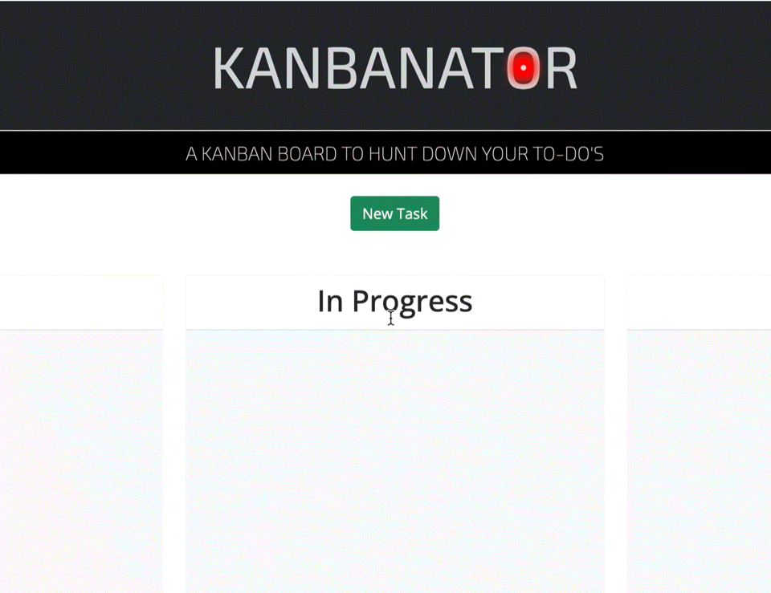

# Kanbanator
Hunt down your to-do's like the Terminator... let none of'em alive!

## **ABOUT THE PROJECT**
**Overview**

With Kanbanator, you'll experience the power of the Kanban method, revolutionizing the way you manage tasks and projects. No more juggling multiple spreadsheets or sticky notes – our intuitive interface makes task organization a breeze.

Kanbanator provides users with a visual Kanban board interface, consisting of columns representing different stages of a workflow (e.g., To-Do, In Progress, Done). Users can create, organize, and prioritize tasks by dragging and dropping them across the board.

Find the repo [here](https://github.com/Rod-Freedom/C5-Kanbanator).

## Table of Contents
- [Resources](#resources)
- [Usage](#usage)
- [Get Started](#get-started)
- [License](#license)
- [Credits](#credits)

## Resources
* For the HTML:
    * Favicon.
    * Meta description.
    * `defer` attribute.
    * Bootstrap.
    * jQuery.
    * Google Fonts.
* For the CSS:
    * Intuitive classes.
    * `::after` art.
    * Single property selectors.
    * Bootstrap and jQuery classes.
    * ```Calc()``` sizes for responsiveness.
    * Transitions.
* For JavaScript
    * Changes in the DOM.
    * jQuery methods.
    * Event listeners.
    * Loops with `forEach`.
    * Local storage.
    * `setTimeout` executions.
    * Arrow functions.
    * `dayjs()` API.
    * `crypto.randomUUID()` method.
* For jQuery
    * `.draggable()`
    * `.droppable()`
    * `.on()`


## Usage
The site is intuitive and easy to use.

Remember to check out a cool feature that lights the Kanbanator's eye on the main title when you hover.
> 

Also on the logo!
> 

Adding a new task is a straightforward process; just click on `New task`. 
> 

However, it's crucial to fill out the form correctly by adding a `Title`, `Description`, and `Date` of the task. Failure to do so will prevent you from continuing. Once you've completed the form, hit `Add Task`, and your new task will appear in the to-do column.
> 

You can add as many as you like. Each task will be colored according to its due date: red for urgent, yellow for close, and white for safe.
> 

Move the tasks as you wish, depending on their status. Done tasks will get green!
> 

Last but not least, you can remove any task, maybe because it's TERMINATED!
> 

## Get Started
[Click here](https://rod-freedom.github.io/C5-Kanbanator/), and hunt down your to-do's!

## License
<br>
See the [license](https://github.com/Rod-Freedom/C5-Kanbanator/blob/main/LICENSE) for more details.

## Credits
All the code was created by [Rod's Freedom](https://github.com/Rod-Freedom) with the help of [jQuery UI](https://jqueryui.com/) interactions.
